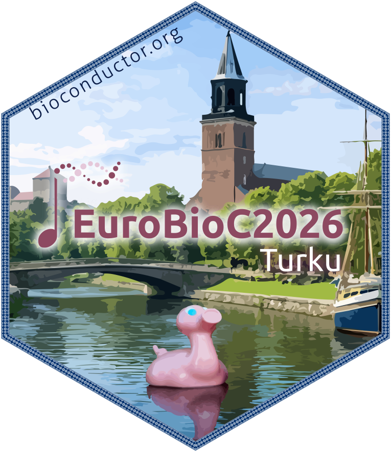

:::: {.columns}

::: {.column width="5%"}

:::

::: {.column width="43%"}
::: {.img-float}
{style="width: 25%; float: left; margin: 5px;"}
:::
\
The European Bioconductor Conference (EuroBioC2026) will take place on the
**first week of June** in **Turku, Finland**. EuroBioC2026 will bring together
the  Bioconductor community to showcase the latest cutting-edge developments on
Bioconductor software packages, as well as on broader emerging technologies
impacting computational biology.

<div style="clear: both;"></div>

<!--

::: {.promo-banner}

### Live streaming available

Can't attend in-person? Join us online **for free!**

See more information from [here](pages/streaming.qmd).

:::

-->

::: {.promo-banner}

## EuroBioC2026 by the numbers

<div class="stats">

<div class="stat">
<div class="value">147</div>
<div class="label">In-person attendees</div>
</div>

<div class="stat">
<div class="value">23</div>
<div class="label">Countries</div>
</div>

<div class="stat">
<div class="value">4</div>
<div class="label">Keynotes</div>
</div>

<div class="stat">
<div class="value">25</div>
<div class="label">Speakers</div>
</div>

<div class="stat">
<div class="value">68</div>
<div class="label">Posters</div>
</div>

<div class="stat">
<div class="value">6</div>
<div class="label">Workshops</div>
</div>

<div class="stat">
<div class="value">9</div>
<div class="label">Flash talks</div>
</div>

<div class="stat">
<div class="value">3</div>
<div class="label">B-o-F sessions</div>
</div>

<div class="stat">
<div class="value">∞</div>
<div class="label">Online attendees</div>
</div>

</div>

:::

:::

::: {.column width="4%"}

:::

::: {.column width="43%"}
::: {style="text-align:center;"}
\

```{r}
#| label: timer
#| results: asis
#| echo: false
#| warning: false
#| message: false
source("R/timer.R")
countdown_timer("2026-06-03 09:00:00", "2026-06-05 14:00:00")
```

**Important dates**
:::

- ~~**November 24**: Call for abstracts opens~~
- ~~**January 30**: Call for abstracts closes~~
- ~~**January 31**: Sticker design contest closes~~
- ~~**February 13**: Call for abstracts closes (final extended deadline)~~
- ~~**February 20**: Registration opens~~
- ~~**April 8**: Call for late-breaking poster abstract opens~~
- ~~**May 3**: Call for late-breaking poster abstract closes~~
- ~~**May 3**: Registration closes~~
- ~~**May 18**: Call for late-breaking poster abstract closes (final extended deadline)~~
- ~~**May 18**: Registration closes (final extended deadline)~~
- ~~**June 1-2**: Workshop and hackathon~~
- ~~**June 3-5**: The EuroBioC2026 conference!~~

<!--
- <span class="deadline"><strong>June 3-5:</strong> The EuroBioC2026 conference!</span>
-->

:::

::: {.column width="5%"}

:::

::::

```{r}
#| label: carousel
#| classes: '.g-col-lg-6 .g-col-12 .g-col-md-12'
#| warning: false
#| echo: false
source("R/carousel.R")
carousel(
    "gallery-carousel",
    3000, # flip time in ms
    yaml.load_file("data/carousel.yml")
)
```

# \ \ \ Partnering with

```{r}
#| label: sponsors
#| results: asis
#| echo: false
#| warning: false
#| message: false
source("R/sponsors.R")
render_sponsors_home(
    "data/sponsors.csv",
    ncol = 3
)
```
