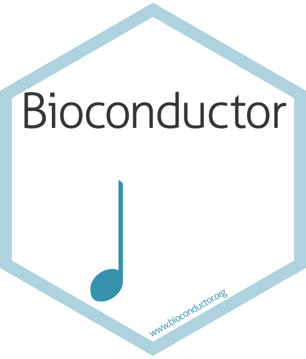
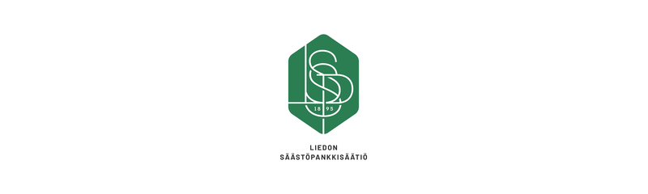

:::: {.columns}

::: {.column width="5%"}

:::

::: {.column width="43%"}
::: {.img-float}
{style="width: 25%; float: left; margin: 5px;"}
:::
\
The European Bioconductor Conference (EuroBioC2026) will take place on
**June 3-5, 2026**, in **Turku, Finland**. EuroBioC2026 will
bring together the Bioconductor community to showcase the latest cutting-edge
developments on Bioconductor software packages, as well as on broader emerging
technologies impacting computational biology.

:::

::: {.column width="4%"}

:::

::: {.column width="43%"}
::: {style="text-align:center;"}
\
**Important dates**
:::

- **November 24**: Call for abstracts opens
- ~~**January 30**: Call for abstracts closes~~
- ~~**January 31**: Sticker design contest closes~~
- <span class="deadline"><strong>February 13:</strong> Call for abstracts closes (final extended deadline)</span>
- **June 1-2**: Workshop and hackathon
- **June 3-5**: The EuroBioC2026 conference!

:::

::: {.column width="5%"}

:::

::::

```{r}
#| label: carousel
#| classes: '.g-col-lg-6 .g-col-12 .g-col-md-12'
#| warning: false
#| echo: false
source("R/carousel.R")
carousel(
    "gallery-carousel",
    5555, # flip time in ms
    yaml.load_file("data/carousel.yml")
)
```

# \ \ \ Partnering with

:::: {.columns}
::: {.column width="10%"}
:::

::: {.column width="80%"}

:::: {.columns}
::: {.column width="30%"}
[{width=100%}](https://tsv.fi/en){target="_blank"}
:::

::: {.column width="2%"}
:::

::: {.column width="12%"}
[{width=100%}](https://liedonsaastopankkisaatio.fi/en/){target="_blank"}
:::

::: {.column width="1%"}
:::

::: {.column width="24%"}

:::

::: {.column width="1%"}
:::

::: {.column width="24%"}

:::
::::

:::

::: {.column width="10%"}
:::

::::

:::: {.columns}
::: {.column width="10%"}
:::

::: {.column width="80%"}

::: {.column width="10%"}
:::

::::
