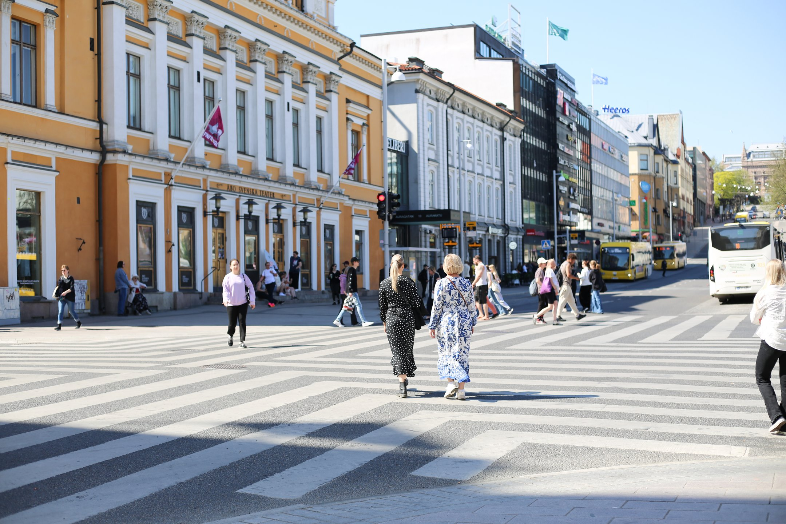
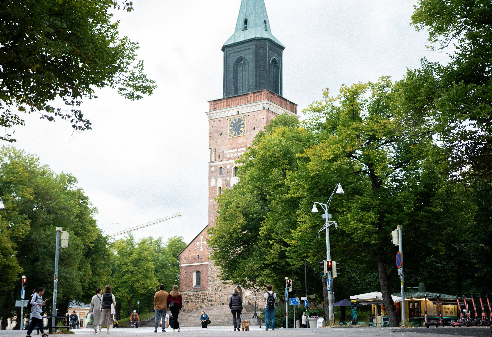
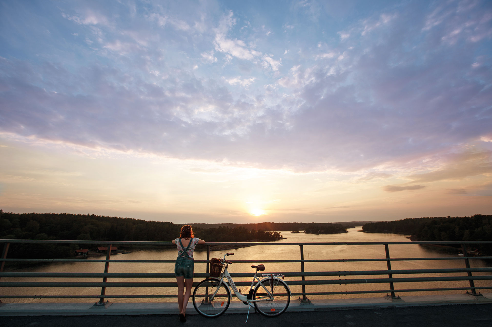
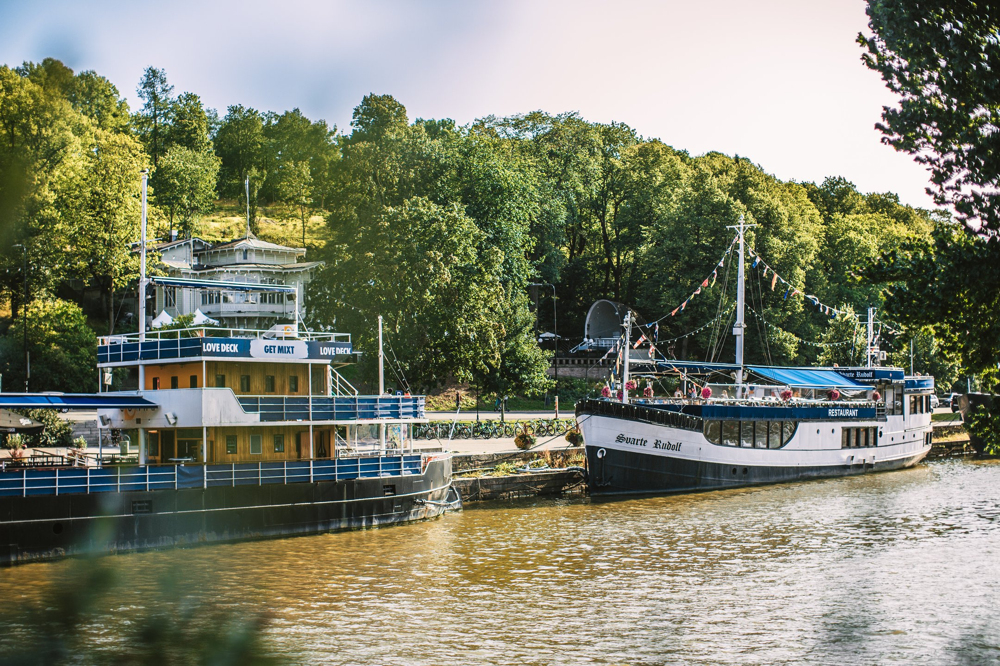
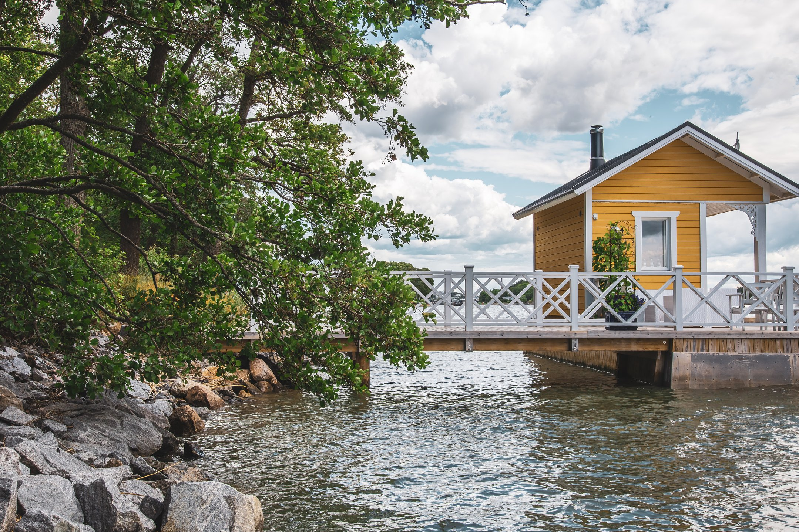

# About Turku

Turku&mdash;located in the region of Southwest Finland, one of Finland’s biggest
cities. The oldest city of Finland, founded in 1229, is today the dynamic
capital of its region, Southwest Finland, an exciting mixture of old and new.
Turku is proud of its strong community spirit, innovation, and close cooperation
with the institutes of higher education. Turku has a compact size, perfect for
exploring the city. You’ll find most hotels, restaurants, and attractions within
walking distance of the centre. If you have a chance, visit also the unique and
beautiful Turku archipelago!
 

## Modern, yet historic

Turku, the former capital of Finland, lies 165 kilometres west of present-day
capital Helsinki. Turku offers a skilled and educated workforce, modern
municipal engineering, good international connections and flexible services for
companies and businesses. Situated at the mouth of the River Aura, Turku is a
major port city today. Turku is known as a bilingual city; around five percent
of the population is Swedish-speaking. A great portion of Turku residents are
students: every fourth person is either student or professional in higher
education institute. Urban life is focused around the river, and some of the
most interesting sights are located on its banks, such as the Turku Castle,
Finland’s national shrine the Turku Cathedral, and the Old Grand Market Square.
 

## Turku facts

*	one of the largest cities in Finland
*	the first school in Finland was established in Turku, the old Cathedral school in the 13th century
*	two universities and four university of applied sciences
*	40 000 higher education students
*	more than 100 nationalities
*	declared the Food Capital of Finland
*	surrounded by a unique archipelago of thousands of islands and skerries

## What to do in Turku?

Explore the interesting mix of urban city culture in Turku and the uniqueness
of the breathtaking Archipelago with its 40 000 islands. Turku, the European
Capital of Culture 2011, is a vibrant and modern city full of life and
activities with a compact size and easy walking distances. Feel the city spirit
by walking along the banks of Aura River, the heart and soul of Turku, and visit
the Riverboat restaurants along the river shores.

The city is also a must visit place for foodies and is gaining reputation for
its splendid restaurant scene – all the way to the point of referring to the
city as being the Food Capital of Finland. Furthermore, do not miss to try some
local delicacies in the over 120 year old Market Hall. The city also offers a
great number of interesting museums as for instance the Luostarinmäki, with its
old wooden houses, and the Aboa Vetus Ars Nova Museum where you’ll find both
ruins of the medieval Turku as well as contemporary art. The famous Moomins
also live in this region; the Moominworld in Naantali is located only 16
kilometres from Turku.

Just outside Turku you’ll find a breathtakingly beautiful and the world’s
largest Archipelago, with around 40.000 islands – a spectacular area for
various kinds of island hopping excursions with boat, car or by bike. Also, do
not miss to explore the closest island to Turku; Ruissalo, which can easily be
reached by waterbus from the Aura River during the summer season. Do as locals
&mdash;bring some local picnic delicacies with you and head to the pure nature
of Ruissalo.

See more tips from the [Visit Turku website](https://en.visitturku.fi/)!

