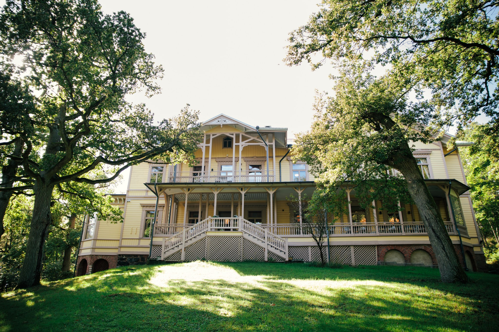
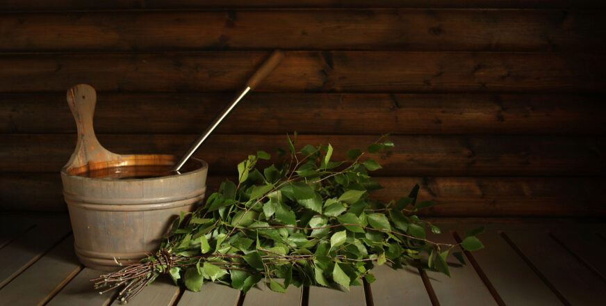
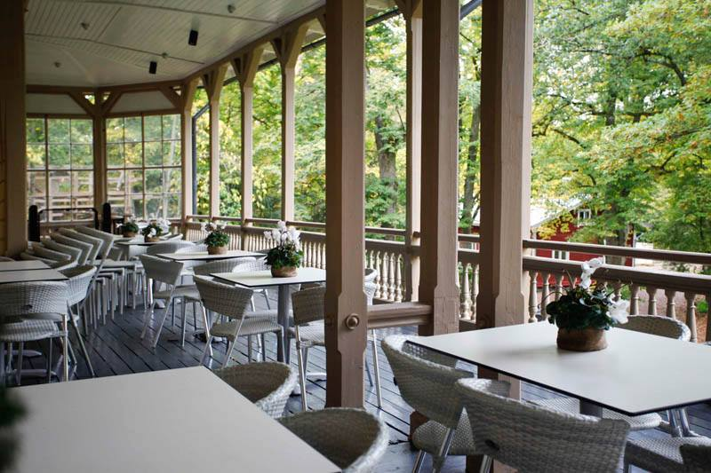

# Conference dinner

::: {.callout-note}
Registration for the conference dinner is done through the conference registration form. The dinner costs €10. See **[registration](registration.qmd)** for details.
:::

## Experience Finnish midsummer

<div style="float: right; width: 35%; margin: 0 1rem 1rem 0;">



<div style="font-size: 0.85rem; color: #666; margin-top: 0.3rem;">
© Riku Norakari
</div>

</div>

The conference dinner takes place on a beautiful island of
[Ruissalo](https://en.wikipedia.org/wiki/Ruissalo) on Wednesday
3rd of June. Ruissalo is a popular recreational area in Turku, and the first
island Turku Achipelago&mdash;the largest archipelago in the world!
The venue&mdash;Villa Marjaniemi&mdash;is a 150-year-old villa that has hosted
many celebrations over the years.

The evening is inspired by Juhannus, an important Finnish summer tradition when
people gather to celebrate nature and the summer. The program includes dinner,
optional sauna, and informal outdoor activities.

**Wednesday, June 3**

- **18:00** – Buses depart from the conference venue  
- **19:00** – Dinner  
- **20:30** – Sauna, networking, and outdoor games  
- **23:00** – Buses return

<div style="clear: both;"></div>

## What to expect

<div style="float: right; width: 35%; margin: 0 1rem 1rem 0;">


</div>

- Dinner with Finnish cuisine
- Opportunity to join a sauna
- Informal networking
- Light outdoor activities

Participation in sauna and activities is optional.

<div style="clear: both;"></div>

## Dress code

No dress code. If you want to go to sauna,
**please take your swimwear with you.**

## Sauna guidelines

<div style="float: left; width: 35%; margin: 0 1rem 1rem 0;">



<div style="font-size: 0.85rem; color: #666; margin-top: 0.3rem;">
© iStock
</div>

</div>

Sauna is an optional part of the evening program and everyone is welcome to
participate at their own comfort level. We want to make the experience relaxing,
inclusive, and respectful for all attendees.

<div style="clear: both;"></div>

Please note the following:

- **Swimwear is required at all times** in the sauna and swimming areas.
- Separate sauna times are arranged for women and men, followed by an inclusive sauna session open to everyone regardless of gender identity.
- Participation in the mixed/inclusive sauna session is entirely optional.
- Respect other participants’ privacy, personal space, and boundaries at all times.
- Photography is not allowed in sauna or swimming areas.
- Swimming is only allowed together with others for safety reasons. Please do not swim alone.
- Everyone is expected to follow the conference Code of Conduct during all social activities, including the sauna.

### Sauna schedule
- 20:30–21:15 – Women’s sauna
- 21:15–22:00 – Men’s sauna
- 22:00–22:45 – Inclusive mixed sauna (open to all genders)

You are also welcome to simply enjoy the outdoor activities and networking
without attending the sauna.

## Location

The dinner will be held in Villa Marjaniemi in Ruissalo island. See the exact
location below.

:::: {.columns .v-center-container}
::: {.column width="4%"}
:::

::: {.column width="40%"}

**Villa Marjaniemi**  
Marjaniementie 50
20100 Turku  
(see [directions](https://osm.org/go/0bv1lOhjA-?way=94003085){target="_blank"})  
:::

::: {.column width="2%"}
:::

::: {.column width="40%"}
[{width="90%"}](https://www.villamarjaniemi.fi/en-gb/home){target="_blank"}
:::

::: {.column width="4%"}
:::

::::

```{r}
#| label: map
#| echo: false
#| message: false
#| warning: false

source(file.path("..", "R", "create_a_map.R"))
create_a_map(show_attractions = FALSE, show_transport = FALSE, show_accommodation = FALSE)
```

## How to get there?

### Organized transport

Buses are arranged for all registered participants. They depart from the
conference venue at 18:00, and the journey takes about 20 minutes.

### Other options

The distance between the conference venue and the dinner venue is approximately
7 km. The venue is easily reachable by public transport, with frequent bus
(stop 28) and a water bus (stop Ruissalon telakka) connections  from the city
center to Ruissalo. You can also consider taking a
taxi or perhaps using a rental bike.

See the [travel information](travel-information.qmd#local-transportation) page for more details on local transportation.

## How to get back?

Return transportation has been arranged for all participants. The buses will
depart from the dinner venue at **23:00**, taking you directly back to the
conference area.

If you prefer to leave earlier or travel independently, there are also several
convenient options available. Local buses run frequently from nearby stops, and
taxis are readily available in the area.

See the [travel information](travel-information.qmd#local-transportation) page for more details on local transportation.

```{r}
#| label: map_route
#| echo: false
#| message: false
#| warning: false

source(file.path("..", "R", "create_a_map.R"))
create_route_map(file.path("..", "data", "dinner_route.csv"))
```

## Questions?

Do not hesitate to contact the [organizers](organizers.html) at
[eurobioc@bioconductor.org](mailto:eurobioc@bioconductor.org) if you have
any questions or concerns.
