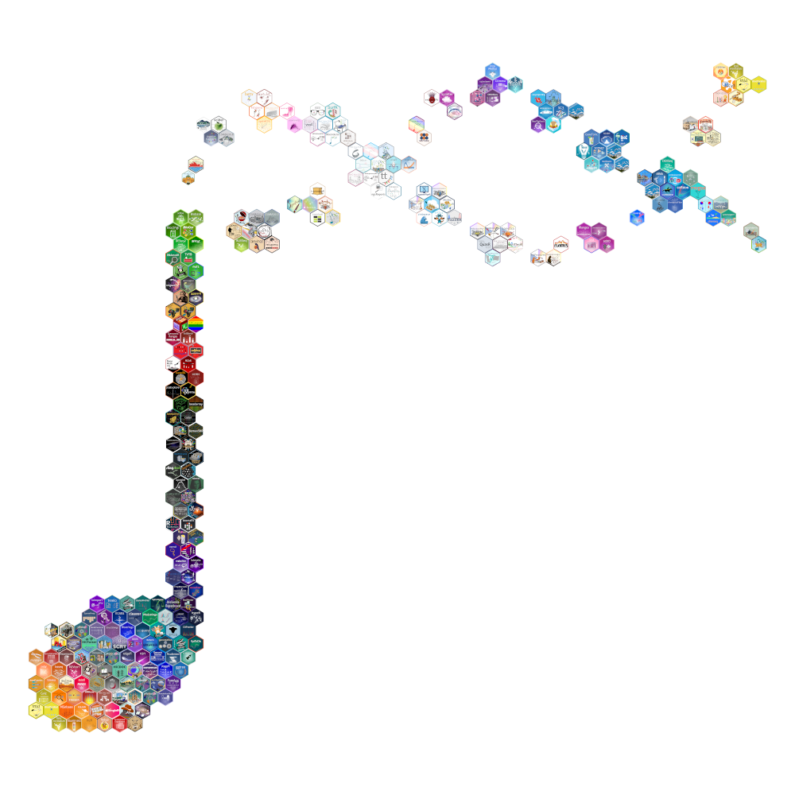
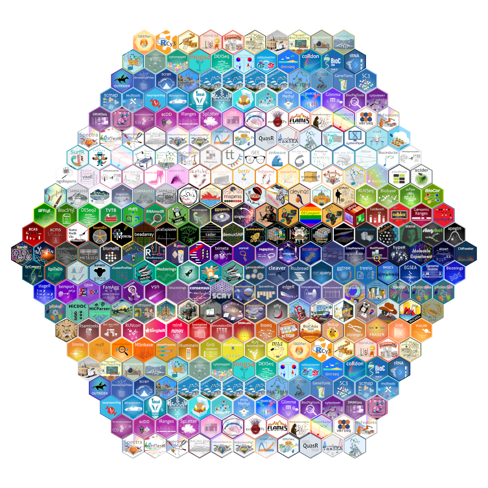

# Sticker-Hexwall

We’re planning a sticker hexwall for **EuroBioc2026**, building on previous community sticker collections at Bioconductor events. The hexwall will be a visual display of Bioconductor package stickers featured in the event space, highlighting the diversity of the Bioconductor ecosystem. 

There are two possible designs: one based on the musical note from the Bioconductor logo, and another using an hexagonal shape. These were created by [Kevin Rue-Albrecht](https://kevinrue.github.io/) with input from the [EuroBioC2025 organising committee](https://eurobioc2025.bioconductor.org/pages/organizers.html).

## Preview Hexwall
:::: {.columns}

::: {.column width="49%"}
{fig-alt="Layout of the hexwall using the musical note design" fig-align="center" width=100% }

:::

::: {.column width="2%"}
:::

::: {.column width="49%"}
{fig-alt="Layout of the hexwall using a hexagonal design" fig-align="center" width=100% }

:::

::::

You can view the full-resolution versions from EuroBioC2025 and explore the included packages on [Zenodo](https://doi.org/10.5281/zenodo.15880368){target="_blank"}.

## How to Get Your Sticker Included
If your package’s sticker is not yet in the [BiocStickers GitHub repository]( https://github.com/Bioconductor/BiocStickers), we encourage you to submit it.

- **Submission deadline**: Thursday, May 21, 2026
- **Submit via**: [BiocStickers GitHub repo](https://github.com/Bioconductor/BiocStickers)
- **Need help?** Reach out to us on [Bioconductor Zulip](https://chat.bioconductor.org) channel #eurobioc2026-turku-conference
- **See an example**: [Example pull request](https://github.com/Bioconductor/BiocStickers/pull/210).

### What to Include in Your Pull Request
- A PNG of your sticker (5cm height, 300dpi)\
- A `README.md` file with:\
    - Package name\
    - Sticker designer/maintainer\
- A line in the [main `README.md`](https://github.com/Bioconductor/BiocStickers/blob/devel/README.md) to display your sticker

## Help Spread the Word
Know a package (perhaps from a colleague, student, or one you use regularly) that’s missing a sticker? Please encourage them to contribute!
