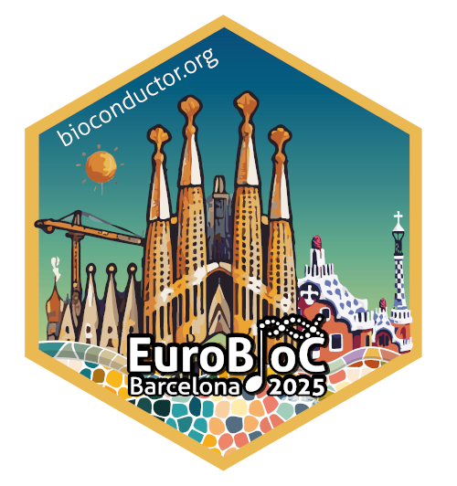
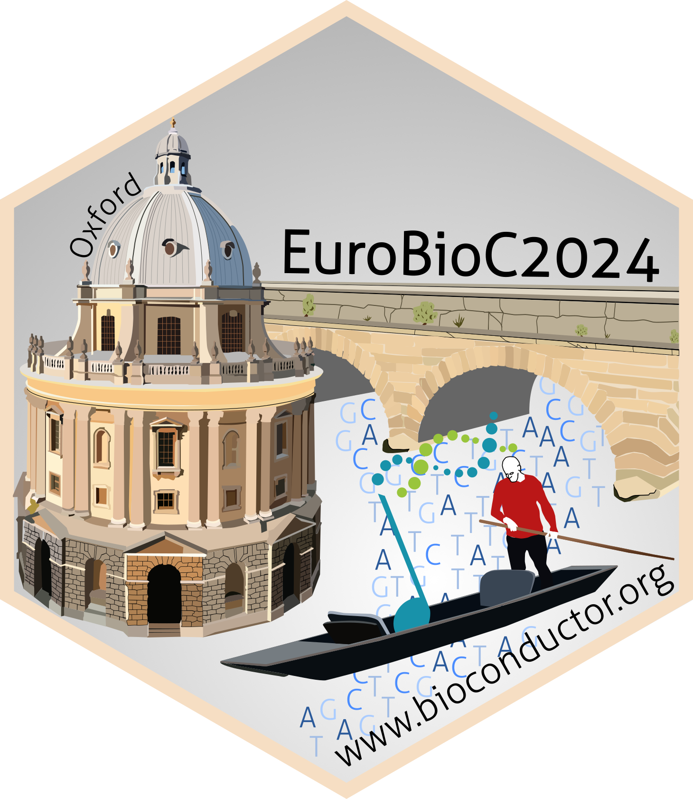
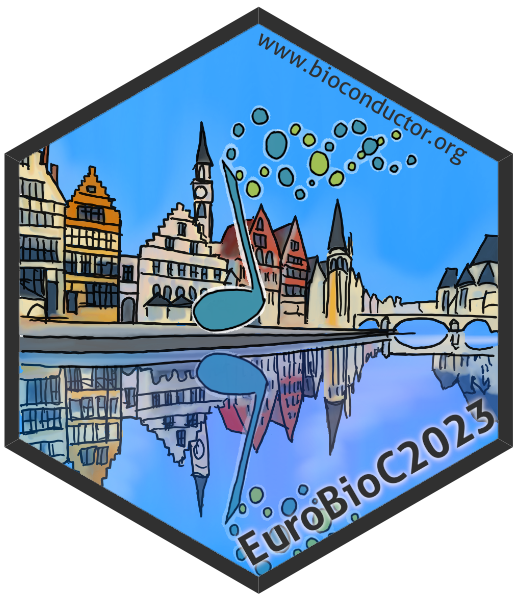
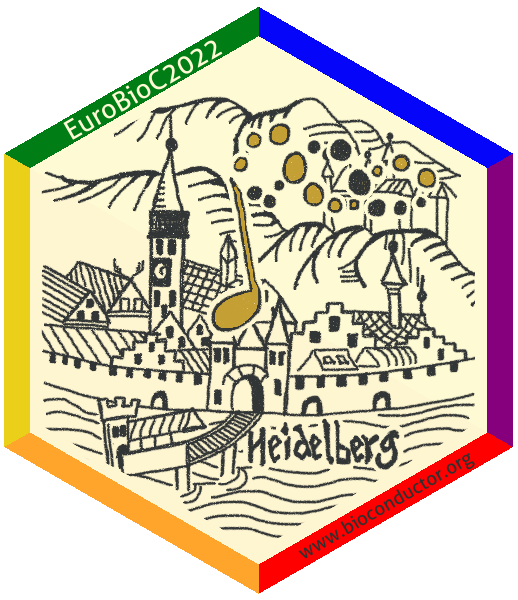

# Sticker contest

::: {.callout-tip icon=false}
## **Sticker contest open**

**Important dates**

- **10 November**: Call for stickers opens
- **31 January**: Call for stickers closes

[Submit your design here!](https://forms.gle/PJKJfLFAgbN7nskB7){target="_blank"}

:::

## Sticker contest rules

- Participation in the EuroBioC2026 sticker contest is voluntary.
- The contest winner will receive a registration fee waiver for the European
Bioconductor Conference 2026. This prize cannot be exchanged for cash or any
other benefits related to the conference.
- The winner is responsible for covering their own travel and accommodation
expenses for the conference.
- If the winner is unable to attend the conference in 2026, the registration fee
waiver cannot be deferred.
The winning design will be selected by the EuroBioC2026 organising committee.
- The winning sticker will be added to the Bioconductor stickers GitHub
repository at
[https://github.com/Bioconductor/BiocStickers](https://github.com/Bioconductor/BiocStickers){target="_blank"}
and licensed under the CC0 1.0 Universal (CC0 1.0) Public Domain License.
- The EuroBioC2026 organising committee will vote for the winning design based
on relevance and creativity.
- All non-winning designs relevant to the conference may be displayed on the
Gallery page of the EuroBioC2026 website with
attributions to the submitter. All participants have the opportunity to opt out
of their submissions being shared in the Gallery.
- As part of our collaborative process, if your design is selected, we may
collaborate on minor adjustments (e.g., font size, color, layout) to ensure the
final design aligns with EuroBioC2026 branding while honouring your original
vision.
- You may use generative AI tools (e.g., ChatGPT) to create your design.
However, please be prepared to make any minor tweaks requested by the organising
committee.

## Sticker contest guidelines

- Submit your design by **January 31st, 2026** (in PDF or SVG) through the
submission form. Maximum file size: 5MB.
- Designs should be relevant to the EuroBioC2026 conference. Previous conference
designs generally include a reference to the conference location.
- Include a brief description of your design and its inspiration (optional). 
- Unless otherwise stated, the logo design will be licensed under a CC0 1.0
Universal (CC0 1.0) Public Domain License.
- The design should be hex-shaped. Some examples can be seen in the Bioconductor
stickers repo
[here](https://github.com/Bioconductor/BiocStickers?tab=readme-ov-file#stickers-for-events){target="_blank"}.
- The height of the final image should be 5cm. 
- Ideally, the position of the conference name text (bottom line) should be 18mm
from the top of the image.
- Some suggestions for color definitions:
[http://www.flatuicolorpicker.com/category/all](http://www.flatuicolorpicker.com/category/all){target="_blank"}.

## Stickers from previous conferences

