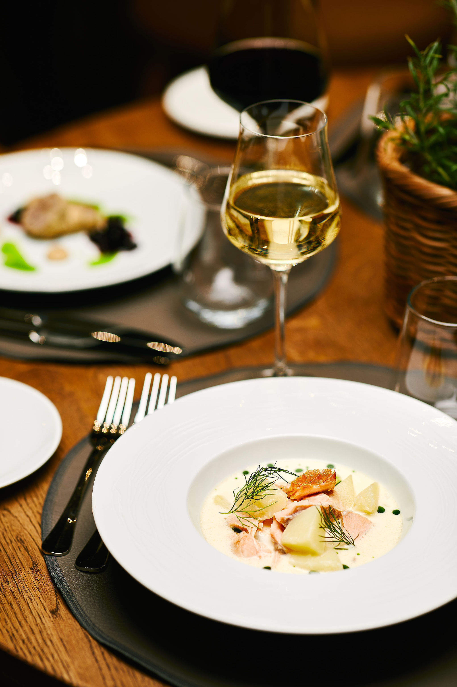
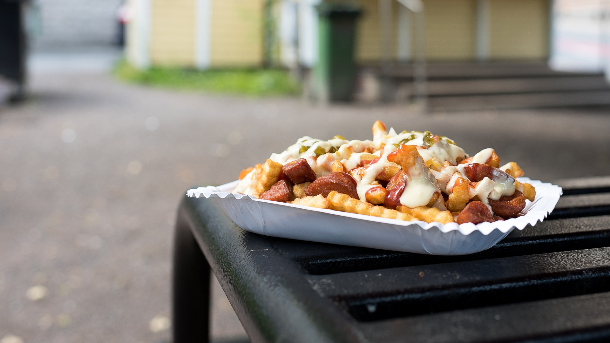
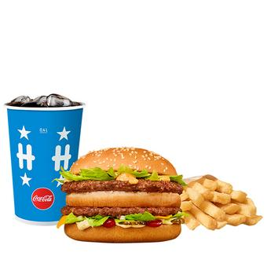
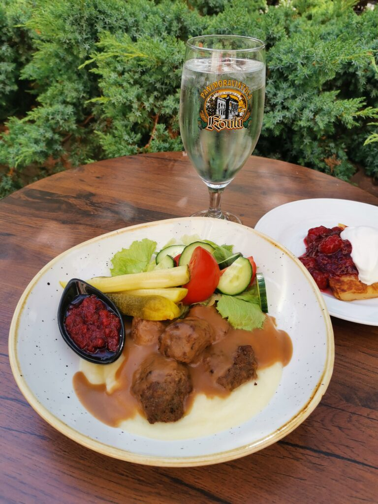
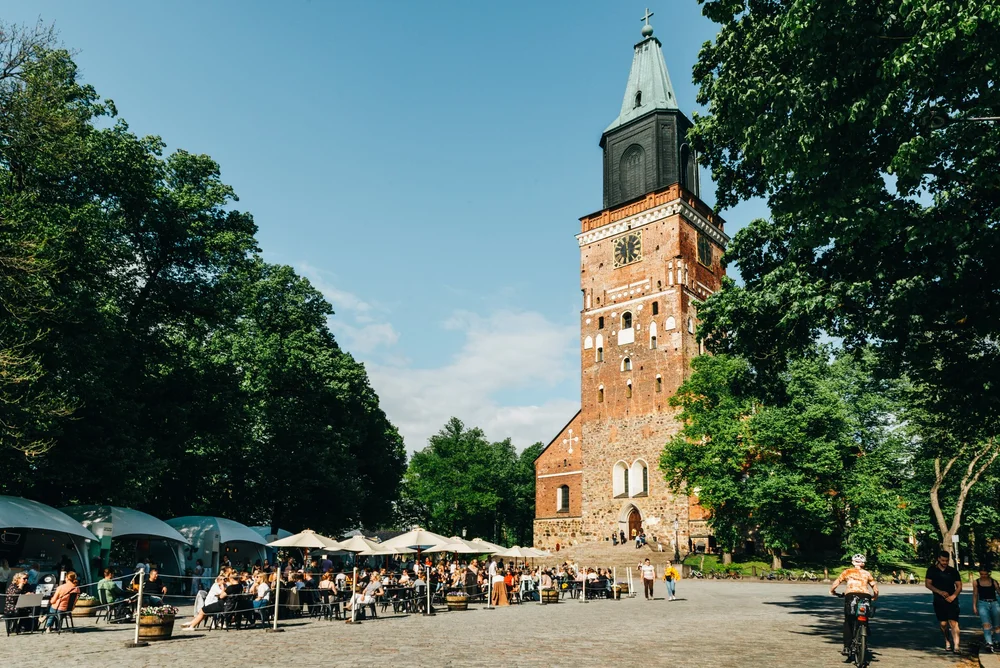
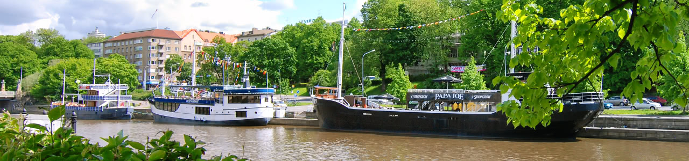

# Walking tour

On Thursday evening, we will host an optional walking tour free of charge. The
tour starts at **19:00** next to the Turku Cathedral, in the heart of old Turku.

We will walk through nearby historical attractions while learning about the
city’s history and culture. The tour lasts **approximately one hour**.

```{r}
#| label: map_route
#| echo: false
#| message: false
#| warning: false

source(file.path("..", "R", "create_a_map.R"))
create_route_map(file.path("..", "data", "walking_tour.csv"), "foot")
```

## After the Walking Tour

After the tour, there is no scheduled program. You are free to continue the
evening at nearby restaurants or bars. Below are some recommended options within
walking distance.

### Recommended places nearby

After the walking tour, there is no program. You can go to restaurant or have a
drink. Below you will find couple good options:


#### Oobu

<div style="float: left; width: 25%; margin: 0 1rem 1rem 0;">



<div style="font-size: 0.85rem; color: #666; margin-top: 0.3rem;">
© Oobu
</div>

</div>

A restaurant specializing in classic Finnish cuisine. Finnish **lohikeitto**
(salmon soup) is an absolute must for visitors who want to experience authentic
Finnish flavors.

**Website:** <a href="https://www.oobu.fi/eng/home.html" target="_blank">oobu.fi</a>

<div style="clear: both;"></div>

#### Mantun Grilli

<div style="float: right; width: 35%; margin: 0 1rem 1rem 0;">



<div style="font-size: 0.85rem; color: #666; margin-top: 0.3rem;">
© Mantun Grilli
</div>

</div>

A classic Finnish grill kiosk. Try traditional street food such as
**lihapiirakka** (meat pie) or **makkaraperunat** (sausage and fries).

**Website:** <a href="https://www.mantungrilli.fi/" target="_blank">mantungrilli.fi</a>

<div style="clear: both;"></div>

#### Hesburger

<div style="float: left; width: 25%; margin: 0 1rem 1rem 0;">



<div style="font-size: 0.85rem; color: #666; margin-top: 0.3rem;">
© Hesburger
</div>

</div>

A fast-food chain originating from Turku. Similar to McDonald’s, but locally
founded and very popular in Finland.

**Website:** <a href="https://www.hesburger.com//" target="_blank">hesburger.com</a>

<div style="clear: both;"></div>

#### Brewery Restaurant Koulu

<div style="float: right; width: 25%; margin: 0 1rem 1rem 0;">



<div style="font-size: 0.85rem; color: #666; margin-top: 0.3rem;">
© Brewery Restaurant Koulu
</div>

</div>

A restaurant located in a former school building. Offers a cozy atmosphere with
good food and a selection of beers and ciders.

**Website:** <a href="https://www.panimoravintolakoulu.fi/?lang=en" target="_blank">panimoravintolakoulu.fi</a>

<div style="clear: both;"></div>

#### Cathedral Terrace

<div style="float: right; width: 35%; margin: 0 1rem 1rem 0;">



<div style="font-size: 0.85rem; color: #666; margin-top: 0.3rem;">
© Roosa Karhu
</div>

</div>

A summer terrace located right below Turku Cathedral. Offers food, drinks, and
often live music in a relaxed outdoor setting.

**Website:** <a href="https://kirkkopuistonterassi.com/" target="_blank">kirkkopuistonterassi.com</a>

<div style="clear: both;"></div>

#### River boats 

<div style="float: left; width: 45%; margin: 0 1rem 1rem 0;">



<div style="font-size: 0.85rem; color: #666; margin-top: 0.3rem;">
© turkulaiset.fi
</div>

</div>

A collection of stationary riverboats along the Aura River serving food and
drinks. Each boat has its own style, but all offer a unique riverside
atmosphere.

<div style="clear: both;"></div>

#### Bonus: Riverside “pussikaljat” (loose translation: beer in a bag)

Buy drinks and snacks from a nearby shop and head to the riverside to enjoy the
atmosphere. This is a relaxed and very Turku way to spend the evening along the
Aura River.
